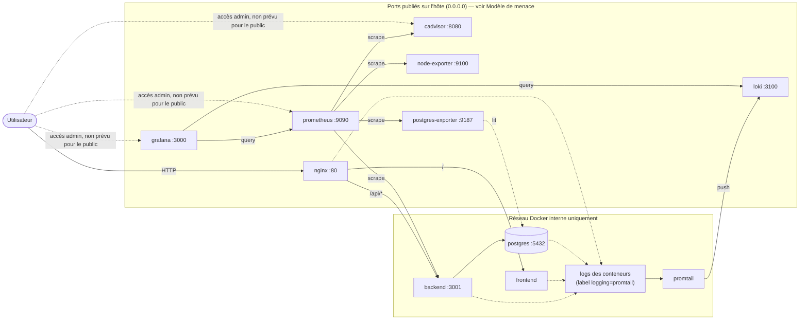

# WebMon

> **TP DevOps** — Plateforme web conteneurisée supervisée avec Prometheus, Grafana, Loki et cAdvisor.

## Équipe

- Membre 1 : Lead Infra (Docker Compose, Nginx, Makefile, scripts)
- Membre 2 : Backend & DB (Node.js API + PostgreSQL)
- Membre 3 : Frontend & UX (HTML/CSS/JS)
- Membre 4 : Observability (Prometheus, Grafana, Loki, dashboards)

## Démarrage rapide

```bash
make start
```

Puis :
- App : http://localhost
- Grafana : http://localhost:3000 (admin/admin)
- Prometheus : http://localhost:9090
- cAdvisor : http://localhost:8080

## Documentation

Voir [docs/INSTALLATION.md](docs/INSTALLATION.md) pour l'installation complète.

## Commandes disponibles

La stack peut être pilotée avec `make` (Linux/macOS) ou avec `scripts/webmon.ps1` (Windows). Les deux couvrent les mêmes cas d'usage sauf `rebuild`, qui n'existe que côté Makefile.

| Commande | Action | Linux (`make`) | Windows (`.\scripts\webmon.ps1`) |
|---|---|---|---|
| `help` | Affiche l'aide (action par défaut du script PowerShell) | ✅ `make help` | ✅ `.\scripts\webmon.ps1 help` |
| `start` | Build les images puis démarre toute la stack | ✅ `make start` | ✅ `.\scripts\webmon.ps1 start` |
| `stop` | Arrête la stack sans supprimer les volumes | ✅ `make stop` | ✅ `.\scripts\webmon.ps1 stop` |
| `restart` | Arrête puis redémarre la stack | ✅ `make restart` | ✅ `.\scripts\webmon.ps1 restart` |
| `logs` | Affiche les logs en temps réel (`--tail=100`) | ✅ `make logs` | ✅ `.\scripts\webmon.ps1 logs` |
| `ps` | Liste les conteneurs | ✅ `make ps` | ✅ `.\scripts\webmon.ps1 ps` |
| `status` | Statut détaillé (nom, état, ports) | ✅ `make status` | ✅ `.\scripts\webmon.ps1 status` |
| `health` | Teste chaque endpoint (frontend, API, Grafana, Prometheus, Loki, cAdvisor) | ✅ `make health` | ✅ `.\scripts\webmon.ps1 health` |
| `build` | Rebuild toutes les images, sans redémarrer | ✅ `make build` | ✅ `.\scripts\webmon.ps1 build` |
| `rebuild` | Rebuild puis redémarre **un seul** service (`S=<service>`) | ✅ `make rebuild S=backend` | ❌ pas d'équivalent dans `webmon.ps1` |
| `clean` | Arrête tout et supprime les volumes (données perdues) | ✅ `make clean` | ✅ `.\scripts\webmon.ps1 clean` |
| `backup` | Sauvegarde Postgres dans `backups/webmon_<timestamp>.sql` | ✅ `make backup` (`scripts/backup.sh`) | ✅ `.\scripts\webmon.ps1 backup` |
| `restore` | Restaure la dernière sauvegarde Postgres | ✅ `make restore` (`scripts/restore.sh`) | ✅ `.\scripts\webmon.ps1 restore` |
| `chaos` | Tue un conteneur applicatif au hasard (test de résilience) | ✅ `make chaos` (`scripts/chaos.sh`, envoie `kill 1` dans le conteneur) | ✅ `.\scripts\webmon.ps1 chaos` (`docker kill` direct sur le conteneur) |
| `stress` | Génère 30s de charge CPU via un conteneur `polinux/stress` | ✅ `make stress` | ✅ `.\scripts\webmon.ps1 stress` |

> `chaos` cible toujours `webmon-backend`, `webmon-frontend` ou `webmon-nginx` au hasard, mais le mécanisme diffère légèrement entre les deux scripts (signal envoyé au process 1 vs. `docker kill` du conteneur) : l'effet observé côté Grafana reste le même.

## Architecture



- **Collecte de métriques :** `prometheus` scrape `node-exporter` (métriques hôte), `cadvisor` (métriques conteneurs), `postgres-exporter` (métriques base de données) et `backend` (métriques applicatives).
- **Collecte de logs :** `promtail` lit les logs Docker des conteneurs portant le label `logging=promtail` (`nginx`, `frontend`, `backend`, `postgres`) et les pousse vers `loki`.
- **Visualisation :** `grafana` interroge `prometheus` et `loki` comme sources de données.
- **Exposition externe :** seul `nginx` (port `80`) est pensé comme point d'entrée public de l'application. Les autres ports publiés (`3000`, `9090`, `3100`, `8080`, `9100`, `9187`) donnent un accès administrateur sans authentification forte — voir la section suivante.

## Modèle de menace

Ce dépôt est un TP DevOps pensé pour tourner sur une machine de lab (poste local ou VM dédiée), pas pour un déploiement en production. Certains choix qui ressembleraient à des failles de sécurité dans un contexte réel sont **volontaires et documentés**, pas des oublis :

- **Identifiants de démonstration en clair** dans `docker-compose.yml` (Postgres `webmon`/`webmon_pwd`, Grafana `admin`/`admin`). Justification détaillée dans [docs/SECURITY_AUDIT.md](docs/SECURITY_AUDIT.md) : périmètre local, valeurs connues de toute l'équipe, sans secret réel à protéger.
- **Tous les ports de supervision sont publiés sur l'hôte** (`0.0.0.0`, voir le tableau des ports dans [docs/INSTALLATION.md](docs/INSTALLATION.md)) plutôt que restreints à `127.0.0.1`. Le Makefile pointe d'ailleurs vers une IP publique de démonstration pour que l'équipe et les correcteurs puissent accéder à Grafana/Prometheus/cAdvisor à distance sans VPN ni tunnel SSH.
- **Aucune authentification** devant Prometheus, Loki, cAdvisor ou node-exporter : n'importe qui atteignant ces ports peut lire les métriques et les logs. Accepté ici car l'objectif est la démonstration de la stack de supervision elle-même, pas la protection de données sensibles.
- **`cadvisor` tourne en `privileged: true`** avec accès à `/var/run/docker.sock`, `/sys`, `/var/lib/docker` : nécessaire pour qu'il introspecte les autres conteneurs, mais cela lui donne un accès très large à l'hôte s'il était compromis.
- **Pas de TLS** : `nginx` sert en HTTP simple, acceptable sur un réseau de lab de confiance.

### Ce qui devrait changer pour un déploiement réel

- Remplacer les identifiants en dur par des variables d'environnement (fichier `.env` non commité) ou un gestionnaire de secrets (Vault, AWS Secrets Manager, Docker Secrets), comme déjà anticipé dans [docs/SECURITY_AUDIT.md](docs/SECURITY_AUDIT.md).
- Ne publier que le strict nécessaire (`80`/`443` pour `nginx`) et binder les autres ports sur `127.0.0.1` ou les retirer du `docker-compose.yml`, en les rendant accessibles uniquement via VPN/tunnel SSH ou un réseau privé.
- Ajouter TLS (certificats Let's Encrypt ou équivalent) devant `nginx`.
- Mettre une authentification (reverse proxy + SSO, ou au minimum un mot de passe fort et unique) devant Grafana, Prometheus, Loki et cAdvisor si ces interfaces doivent rester accessibles à distance.
- Éviter `privileged: true` pour `cadvisor` quand c'est possible, ou au minimum isoler le service sur un réseau/segment dédié.
- Chiffrer et externaliser les sauvegardes Postgres (`backups/`) plutôt que de les laisser en clair sur le disque local.
- Définir une politique de rétention et de purge des logs/métriques adaptée à des données réelles (au lieu des `7d` de rétention Prometheus configurés pour la démo).

