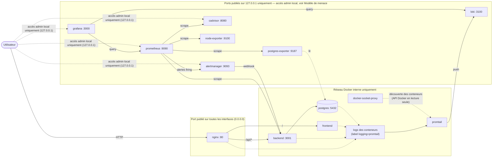

# WebMon

> **TP DevOps** — Plateforme web conteneurisée supervisée avec Prometheus, Grafana, Loki et cAdvisor.

## Équipe

- Membre 1 : Lead Infra (Docker Compose, Nginx, Makefile, scripts)
- Membre 2 : Backend & DB (Node.js API + PostgreSQL)
- Membre 3 : Frontend & UX (HTML/CSS/JS)
- Membre 4 : Observability (Prometheus, Grafana, Loki, dashboards)

## Démarrage rapide

```bash
cp .env.example .env
make start
```

Puis :
- App : http://localhost
- Grafana : http://localhost:3000 (admin/admin)
- Prometheus : http://localhost:9090
- cAdvisor : http://localhost:8080
- Alertmanager : http://localhost:9093 (accessible uniquement en local, 127.0.0.1)

## Alerting

La stack ne se contente plus de collecter et d'afficher des métriques : Prometheus évalue
des règles d'alerte en continu et les transmet à Alertmanager dès qu'elles passent à l'état
`firing`.

### Règles en place

Définies dans [`prometheus/rules/alerts.yml`](prometheus/rules/alerts.yml), chargées par
Prometheus via `rule_files:` dans `prometheus.yml` :

| Alerte | Condition | Sévérité |
|---|---|---|
| `ServiceDown` | Une cible scrapée (`up == 0`) ne répond plus depuis plus de 2 minutes | critical |
| `ContainerRestartLoop` | Un conteneur redémarre plus de 2 fois en 15 minutes (`changes(container_start_time_seconds[15m])`) | warning |
| `HighDiskUsage` | Espace disque disponible sous 15 % sur un point de montage | warning |
| `HighMemoryUsage` | Mémoire d'un conteneur au-dessus de 85 % de sa limite pendant plus de 5 minutes | warning |

Chaque alerte porte un label `severity` et des annotations `summary` / `description` qui
incluent le nom de l'instance/du conteneur concerné, pour être immédiatement lisibles dans
Prometheus et Alertmanager.

> `HighMemoryUsage` se base sur `container_spec_memory_limit_bytes` (exposé par cAdvisor) :
> elle ne se déclenchera que pour les conteneurs auxquels une limite mémoire (`mem_limit` /
> `deploy.resources.limits.memory`) a été fixée, sinon le ratio reste proche de 0.

### Alertmanager

Le service `alertmanager` (voir `docker-compose.yml`) lit
[`alertmanager/alertmanager.yml`](alertmanager/alertmanager.yml) et route toutes les
alertes vers un receiver webhook local (`webhook-local`), sans aucun identifiant réel —
à remplacer par un vrai receiver (Slack, email, PagerDuty...) en production. Comme les
autres ports de supervision, il n'est exposé que sur `127.0.0.1:9093`.

Prometheus est relié à Alertmanager via la section `alerting:` de `prometheus.yml`.

### Tester les alertes

1. Démarrer la stack (`make start`) puis ouvrir http://localhost:9090/rules : les 4 règles
   doivent apparaître avec l'état `ok` (pas d'erreur de chargement).
2. Arrêter un conteneur non critique pour simuler une panne, par exemple :
   ```bash
   docker stop webmon-cadvisor
   ```
3. Sur http://localhost:9090/alerts, l'alerte `ServiceDown` passe d'abord à l'état
   **Pending** (dès que `up == 0`), puis à **Firing** après 2 minutes (le temps défini par
   `for:` dans la règle).
4. Une fois à l'état Firing, l'alerte apparaît dans Alertmanager : http://localhost:9093
   (onglet "Alerts"), avec ses labels (`severity`, `job`, `instance`) et ses annotations.
5. Relancer le conteneur (`docker start webmon-cadvisor`) : l'alerte repasse à `inactive`
   côté Prometheus et se résout côté Alertmanager.

Pour tester `ContainerRestartLoop`, utiliser `make chaos` (ou `scripts/chaos.sh`) plusieurs
fois de suite en moins de 15 minutes sur un même conteneur applicatif : cAdvisor détecte les
changements de `container_start_time_seconds` et l'alerte se déclenche une fois le seuil de
redémarrages dépassé.

`HOST_IP` (défaut `localhost`) contrôle l'hôte affiché dans les URLs ci-dessus et dans `make chaos` ; à surcharger via variable d'environnement, ex. `HOST_IP=192.168.1.10 make start`, ou en la définissant dans `.env` (voir plus bas — le Makefile charge automatiquement `.env` s'il existe).

## Secrets et configuration

Les identifiants sensibles (`POSTGRES_PASSWORD`, `GF_SECURITY_ADMIN_PASSWORD`,
`DATA_SOURCE_NAME`) ne sont plus écrits en dur dans `docker-compose.yml`.
Ils sont lus depuis un fichier `.env` local, non commité (voir
`.gitignore`). Ce même fichier `.env` peut aussi porter `HOST_IP` (voir
ci-dessus), pour garder un seul point de configuration.

Procédure :

1. Copier le fichier d'exemple : `cp .env.example .env`
2. Adapter les valeurs si besoin (mot de passe PostgreSQL, mot de passe
   admin Grafana, chaîne de connexion `DATA_SOURCE_NAME` — elle doit
   rester cohérente avec `POSTGRES_PASSWORD` — et éventuellement
   `HOST_IP`)
3. Démarrer la stack normalement (`make start` ou
   `docker compose up -d`) : Docker Compose charge automatiquement
   `.env` à la racine du projet, et le Makefile fait de même pour
   `HOST_IP`

`.env.example` contient des valeurs de démo fonctionnelles : la stack
démarre en une seule commande sans configuration supplémentaire. Ne
committez jamais votre `.env` local.

## Exposition réseau

Seuls `nginx` (port 80) et l'application sont exposés sur toutes les
interfaces. Les services de supervision (Prometheus, Grafana, Loki,
cAdvisor, node-exporter, postgres-exporter) ne publient leurs ports que
sur `127.0.0.1`, donc uniquement accessibles depuis la machine hôte
elle-même. La communication inter-conteneurs (scraping Prometheus,
etc.) continue de passer par le réseau Docker interne `webmon` via les
noms de service.

## Documentation

Voir [docs/INSTALLATION.md](docs/INSTALLATION.md) pour l'installation complète.

## Commandes disponibles

La stack peut être pilotée avec `make` (Linux/macOS) ou avec `scripts/webmon.ps1` (Windows). Les deux couvrent les mêmes cas d'usage sauf `rebuild` et `test-backup`, qui n'existent que côté Makefile.

| Commande | Action | Linux (`make`) | Windows (`.\scripts\webmon.ps1`) |
|---|---|---|---|
| `help` | Affiche l'aide (action par défaut du script PowerShell) | ✅ `make help` | ✅ `.\scripts\webmon.ps1 help` |
| `start` | Build les images puis démarre toute la stack | ✅ `make start` | ✅ `.\scripts\webmon.ps1 start` |
| `stop` | Arrête la stack sans supprimer les volumes | ✅ `make stop` | ✅ `.\scripts\webmon.ps1 stop` |
| `restart` | Arrête puis redémarre la stack | ✅ `make restart` | ✅ `.\scripts\webmon.ps1 restart` |
| `logs` | Affiche les logs en temps réel (`--tail=100`) | ✅ `make logs` | ✅ `.\scripts\webmon.ps1 logs` |
| `ps` | Liste les conteneurs | ✅ `make ps` | ✅ `.\scripts\webmon.ps1 ps` |
| `status` | Statut détaillé (nom, état, ports) | ✅ `make status` | ✅ `.\scripts\webmon.ps1 status` |
| `health` | Teste chaque endpoint (frontend, API, Grafana, Prometheus, Loki, cAdvisor) | ✅ `make health` | ✅ `.\scripts\webmon.ps1 health` |
| `build` | Rebuild toutes les images, sans redémarrer | ✅ `make build` | ✅ `.\scripts\webmon.ps1 build` |
| `rebuild` | Rebuild puis redémarre **un seul** service (`S=<service>`) | ✅ `make rebuild S=backend` | ❌ pas d'équivalent dans `webmon.ps1` |
| `clean` | Arrête tout et supprime les volumes (données perdues) | ✅ `make clean` | ✅ `.\scripts\webmon.ps1 clean` |
| `backup` | Sauvegarde Postgres dans `backups/webmon_<timestamp>.sql` | ✅ `make backup` (`scripts/backup.sh`) | ✅ `.\scripts\webmon.ps1 backup` |
| `restore` | Restaure la dernière sauvegarde Postgres | ✅ `make restore` (`scripts/restore.sh`) | ✅ `.\scripts\webmon.ps1 restore` |
| `test-backup` | Déroule le cycle complet backup → purge → restore et vérifie qu'il est idempotent | ✅ `make test-backup` (`scripts/test-backup-restore.sh`) | ❌ pas d'équivalent dans `webmon.ps1` |
| `chaos` | Tue un conteneur applicatif au hasard (test de résilience) | ✅ `make chaos` (`scripts/chaos.sh`, envoie `kill 1` dans le conteneur) | ✅ `.\scripts\webmon.ps1 chaos` (`docker kill` direct sur le conteneur) |
| `stress` | Génère 30s de charge CPU via un conteneur `polinux/stress` | ✅ `make stress` | ✅ `.\scripts\webmon.ps1 stress` |

> `chaos` cible toujours `webmon-backend`, `webmon-frontend` ou `webmon-nginx` au hasard, mais le mécanisme diffère légèrement entre les deux scripts (signal envoyé au process 1 vs. `docker kill` du conteneur) : l'effet observé côté Grafana reste le même.

## Architecture



- **Collecte de métriques :** `prometheus` scrape `node-exporter` (métriques hôte), `cadvisor` (métriques conteneurs), `postgres-exporter` (métriques base de données) et `backend` (métriques applicatives).
- **Alerting :** `prometheus` évalue les règles de [`prometheus/rules/alerts.yml`](prometheus/rules/alerts.yml) et transmet les alertes `firing` à `alertmanager`, qui les route vers un webhook local sur `backend` (voir [Alerting](#alerting) ci-dessus).
- **Collecte de logs :** `promtail` découvre les conteneurs portant le label `logging=promtail` (`nginx`, `frontend`, `backend`, `postgres`) via `docker-socket-proxy` (accès en lecture seule à l'API Docker, sans passer par le socket brut), lit leurs logs et les pousse vers `loki`.
- **Visualisation :** `grafana` interroge `prometheus` et `loki` comme sources de données.
- **Exposition externe :** seul `nginx` (port `80`) est pensé comme point d'entrée public de l'application. Les autres ports publiés (`3000`, `9090`, `9093`, `3100`, `8080`, `9100`, `9187`) sont restreints à `127.0.0.1` mais restent sans authentification forte — voir la section suivante.

## Modèle de menace

Ce dépôt est un TP DevOps pensé pour tourner sur une machine de lab (poste local ou VM dédiée), pas pour un déploiement en production. Certains choix qui ressembleraient à des failles de sécurité dans un contexte réel sont **volontaires et documentés**, pas des oublis :

- **Identifiants de démonstration** pour Postgres (`webmon`/`webmon_pwd`) et Grafana (`admin`/`admin`), définis via `.env` (voir [Secrets et configuration](#secrets-et-configuration) ci-dessus) plutôt que réellement secrets : périmètre local, valeurs connues de toute l'équipe, sans secret réel à protéger.
- **Les ports de supervision sont restreints à `127.0.0.1`** (voir le tableau des ports dans [docs/INSTALLATION.md](docs/INSTALLATION.md)) : seul `nginx` (`80`) est publié sans restriction d'interface. Une équipe qui a besoin d'un accès distant à Grafana/Prometheus/cAdvisor sans VPN ni tunnel SSH doit explicitement rouvrir ces ports dans `docker-compose.yml`, en connaissance des risques ci-dessous.
- **Aucune authentification** devant Prometheus, Alertmanager, Loki, cAdvisor ou node-exporter : n'importe qui atteignant ces ports peut lire les métriques et les logs. Accepté ici car l'objectif est la démonstration de la stack de supervision elle-même, pas la protection de données sensibles ; la restriction à `127.0.0.1` limite ce risque au périmètre de la machine hôte.
- **`cadvisor` tourne en `privileged: true`** avec accès à `/var/run/docker.sock`, `/sys`, `/var/lib/docker` : nécessaire pour qu'il introspecte les autres conteneurs, mais cela lui donne un accès très large à l'hôte s'il était compromis.
- **Pas de TLS** : `nginx` sert en HTTP simple, acceptable sur un réseau de lab de confiance.

### Ce qui devrait changer pour un déploiement réel

- Remplacer les identifiants de démo par un vrai gestionnaire de secrets (Vault, AWS Secrets Manager, Docker Secrets) plutôt qu'un `.env` local en clair.
- Ne publier que le strict nécessaire (`80`/`443` pour `nginx`) ; les autres ports sont déjà restreints à `127.0.0.1`, mais pourraient être retirés du `docker-compose.yml` et rendus accessibles uniquement via VPN/tunnel SSH ou un réseau privé.
- Ajouter TLS (certificats Let's Encrypt ou équivalent) devant `nginx`.
- Mettre une authentification (reverse proxy + SSO, ou au minimum un mot de passe fort et unique) devant Grafana, Prometheus, Loki et cAdvisor si ces interfaces doivent rester accessibles à distance.
- Éviter `privileged: true` pour `cadvisor` quand c'est possible, ou au minimum isoler le service sur un réseau/segment dédié.
- Chiffrer et externaliser les sauvegardes Postgres (`backups/`) plutôt que de les laisser en clair sur le disque local.
- Définir une politique de rétention et de purge des logs/métriques adaptée à des données réelles (au lieu des `7d` de rétention Prometheus configurés pour la démo).

